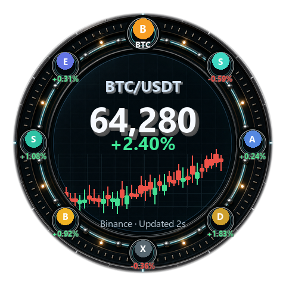
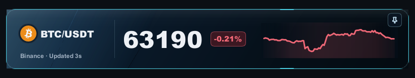
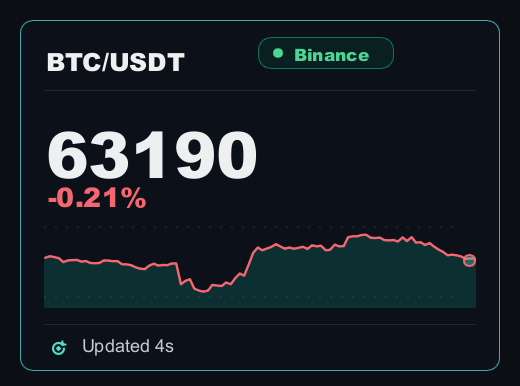
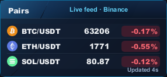
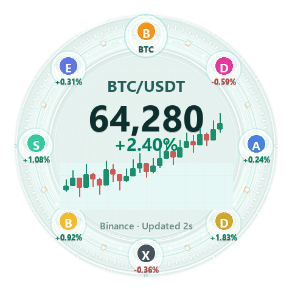
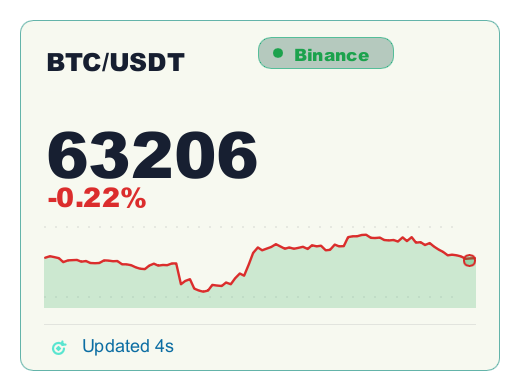

<p align="center">
  
</p>

<h1 align="center">Crypto HUD</h1>

<p align="center">
  <strong>行情一直在，需要时扫一眼。</strong><br>
  常驻 Windows 桌面的原生加密行情组件，不抢走你的注意力。
</p>

<p align="center">
  <a href="README.md">English</a> ·
  <a href="README.zh-CN.md">简体中文</a> ·
  <a href="README.zh-TW.md">繁體中文</a> ·
  <a href="README.es.md">Español</a> ·
  <a href="README.pt-BR.md">Português</a> ·
  <a href="README.vi.md">Tiếng Việt</a><br>
  <a href="README.id.md">Bahasa Indonesia</a> ·
  <a href="README.tr.md">Türkçe</a> ·
  <a href="README.ko.md">한국어</a> ·
  <a href="README.ja.md">日本語</a> ·
  <a href="README.ru.md">Русский</a> ·
  <a href="README.ar.md">العربية</a>
</p>

<p align="center">
  
  
  
  
</p>

<p align="center">
  <a href="#快速开始"><strong>本地运行</strong></a> ·
  <a href="#组件效果"><strong>查看组件</strong></a> ·
  <a href="CUSTOM_UI_PLUGIN_DEVELOPMENT.md"><strong>开发组件</strong></a>
</p>

<p align="center">
  <picture>
    <source media="(prefers-color-scheme: dark)" srcset="crates/crypto-hud/plugins/com.cryptohud.market-compass/ui/preview-dark.png">
    <source media="(prefers-color-scheme: light)" srcset="crates/crypto-hud/plugins/com.cryptohud.market-compass/ui/preview-light.png">
    
  </picture>
</p>

<p align="center">
  <sub>行情就在工作区边缘。不用切交易所，不连接钱包，也不制造噪音。</sub>
</p>

---

Crypto HUD 是一款轻量、本地优先的桌面行情工具，适合想关注几个币种、
又不想整天泡在交易终端里的人。把组件摆在顺眼的位置，继续工作；
只有当行情值得在意时，再抬眼看一下。

<table>
  <tr>
    <td width="25%"><strong>⚡ 原生轻量</strong><br><sub>Rust + Slint，不依赖 Electron、Tauri、WebView 或内置浏览器。</sub></td>
    <td width="25%"><strong>👀 一眼看懂</strong><br><sub>可拖拽、可置顶的组件，让关键数字一直在视线内。</sub></td>
    <td width="25%"><strong>🔒 本地优先</strong><br><sub>布局和偏好保存在本机，不需要账号或 API Key。</sub></td>
    <td width="25%"><strong>🙈 随时安静</strong><br><sub>按 <kbd>Alt</kbd> + <kbd>C</kbd> 一键隐藏或恢复全部组件。</sub></td>
  </tr>
</table>

## 组件效果

你可以选择极简行情条、完整图表卡片或多币种看板。内置组件和自定义组件
使用同一套插件协议。

<p align="center">
  <picture>
    <source media="(prefers-color-scheme: dark)" srcset="crates/crypto-hud/plugins/com.cryptohud.focus-ticker/ui/preview-dark.png">
    <source media="(prefers-color-scheme: light)" srcset="crates/crypto-hud/plugins/com.cryptohud.focus-ticker/ui/preview-light.png">
    
  </picture>
</p>

<p align="center"><strong>Focus Ticker</strong> — 只看一个市场，不多占一点注意力。</p>

<table>
  <tr>
    <td width="50%" align="center">
      <picture>
        <source media="(prefers-color-scheme: dark)" srcset="crates/crypto-hud/plugins/com.cryptohud.trust-card/ui/preview-dark.png">
        <source media="(prefers-color-scheme: light)" srcset="crates/crypto-hud/plugins/com.cryptohud.trust-card/ui/preview-light.png">
        
      </picture>
    </td>
    <td width="50%" align="center">
      <picture>
        <source media="(prefers-color-scheme: dark)" srcset="crates/crypto-hud/ui/previews/quote-board-dark.png">
        <source media="(prefers-color-scheme: light)" srcset="crates/crypto-hud/ui/previews/quote-board-light.png">
        
      </picture>
    </td>
  </tr>
  <tr>
    <td align="center"><strong>Trust Card</strong><br><sub>当一个交易对值得认真关注，给你更多上下文。</sub></td>
    <td align="center"><strong>Quote Board</strong><br><sub>用很小的空间，同时感知多个市场。</sub></td>
  </tr>
</table>

<details>
  <summary><strong>桌面是浅色主题？</strong> 查看浅色效果</summary>
  <br>
  <table>
    <tr>
      <td width="50%" align="center"></td>
      <td width="50%" align="center"></td>
    </tr>
  </table>
</details>

## 为后台常驻而生

- **真正的桌面组件**：自由拖动、保持置顶，并在下次启动时恢复原来的布局。
- **四个公开行情源**：Binance、Coinbase、OKX 和 Hyperliquid。
- **灵活的外观**：多种组件样式、深浅色主题、透明度控制和涨跌颜色偏好。
- **全局专注开关**：按 <kbd>Alt</kbd> + <kbd>C</kbd> 一次隐藏或显示整个 HUD。
- **12 种界面语言**：包含简繁中文、英语、日语、韩语、西班牙语、葡萄牙语和 RTL 阿拉伯语等。
- **支持插件扩展**：用 Slint 编写本地组件，声明所需数据、主题、参数和预览图。

支持的界面语言：`en`、`zh-CN`、`zh-TW`、`es-419`、`pt-BR`、`vi`、`id`、
`tr`、`ko`、`ja`、`ru` 和 `ar`。

> [!IMPORTANT]
> Crypto HUD 刻意只做行情查看。它会读取公开市场数据，但不会下单、连接钱包、
> 托管资产，也不会索要私钥、助记词、交易所账号或 API Key。

## 快速开始

Crypto HUD 面向 Windows 构建。仓库使用 `mise` 固定 Rust `1.96`，
并提供一条命令即可完成的本地启动任务。

```powershell
git clone https://github.com/crypto-widget/crypto-hud.git
cd crypto-hud
mise trust
mise install
mise run run-app
```

以上命令会各启动一个内置组件。如果只想启动指定数量的组件：

```powershell
cargo run -p crypto-hud -- --widgets 3
```

启动后：

1. 拖动任意组件，把它放到合适的位置。
2. 点击托盘图标打开设置。
3. 添加组件、选择币种、切换主题并调整透明度。
4. 想要干净桌面时，按 <kbd>Alt</kbd> + <kbd>C</kbd>。

组件位置和偏好设置会自动保存。

## 做成你喜欢的样子

Crypto HUD 的内置组件由本地插件系统驱动。组件可以声明币种、行情数据能力、
尺寸、主题和设置参数，同时不直接拥有网络或文件系统权限。

- 阅读[自定义 UI 插件开发指南](CUSTOM_UI_PLUGIN_DEVELOPMENT.md)。
- 查看[插件协议与内置示例](crates/crypto-hud/plugins/README.md)。
- 从现有 Slint 组件出发，给行情换一种形状。

## 开发

```powershell
mise run format-check
mise run check
mise run test
mise run run-app
```

<details>
  <summary><strong>仓库结构与 GUI 冒烟测试</strong></summary>
  <br>

  ```text
  crates/
    crypto-hud-core/          市场符号、格式化和提醒基础逻辑
    crypto-hud-market/        公开行情数据获取
    crypto-hud-runtime/       组件运行时视图协议
    crypto-hud-shell-state/   设置和布局状态持久化
    crypto-hud/               原生 Windows 外壳和 Slint UI
  ```

  ```powershell
  powershell -ExecutionPolicy Bypass -File .\scripts\gui-smoke.ps1
  powershell -ExecutionPolicy Bypass -File .\scripts\gui-settings-interaction-smoke.ps1
  powershell -ExecutionPolicy Bypass -File .\scripts\single-instance-smoke.ps1
  ```
</details>

<details>
  <summary><strong>Windows 发布打包</strong></summary>
  <br>

  发布包由本地 Windows 脚本生成。打包流程会在 `dist/` 中创建 zip、校验和与
  release manifest。生产包必须使用 Authenticode 签名；smoke 脚本仅通过明确的
  本地开发开关使用未签名包。内置组件安装到 `plugins/`；预览图和应用图标分别
  安装到 `resources/previews/` 与 `resources/icon.ico`。所有随包文件都由已签名的
  发布完整性元数据绑定。

  ```powershell
  cargo test --locked --workspace
  cargo audit
  powershell -ExecutionPolicy Bypass -File .\scripts\release-process-check.ps1
  powershell -ExecutionPolicy Bypass -File .\scripts\package-smoke.ps1 -SkipBuild
  powershell -ExecutionPolicy Bypass -File .\scripts\update-smoke.ps1 -SkipBuild
  # 先配置 CRYPTO_HUD_SIGN_CERT_PATH（或 CRYPTO_HUD_SIGN_CERT_BASE64）以及
  # CRYPTO_HUD_SIGN_CERT_PASSWORD。正式签名时始终重新构建。
  powershell -ExecutionPolicy Bypass -File .\scripts\package-windows.ps1 -Version v0.9.7 -Sign
  ```

  首次安装生产包时，应在执行安装脚本中的任何代码前先验证其签名。确认 `Status`
  为 `Valid`，并核对 `SignerCertificate.Subject` 与发布页公布的发布者身份一致；随后
  使用 `AllSigned`，不要绕过 PowerShell 执行策略：

  ```powershell
  Get-AuthenticodeSignature -LiteralPath .\install.ps1 | Format-List Status,SignerCertificate
  powershell -ExecutionPolicy AllSigned -File .\install.ps1
  ```

  `-ExecutionPolicy Bypass` 和 `CRYPTO_HUD_ALLOW_UNSIGNED_SMOKE=1` 仅用于仓库中
  隔离运行的未签名 smoke 测试，不是生产安装选项。
</details>

## 路线图

当前重点包括更清晰的数据源健康状态、价格与 24 小时涨跌提醒、更丰富的组件管理、
更好的首次启动摆放，以及更完整的安装器。

欢迎参与贡献。请查看[贡献指南](CONTRIBUTING.md)与[更新日志](CHANGELOG.md)；
报告漏洞前，请先阅读[安全策略](SECURITY.md)。

## 许可证

MIT © Crypto HUD Contributors
